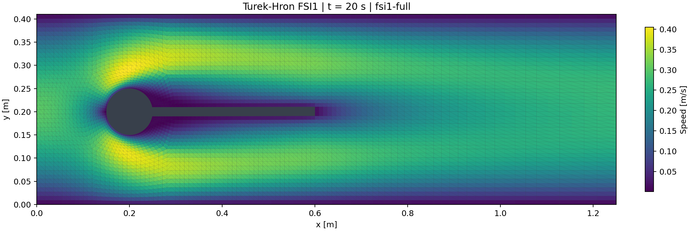
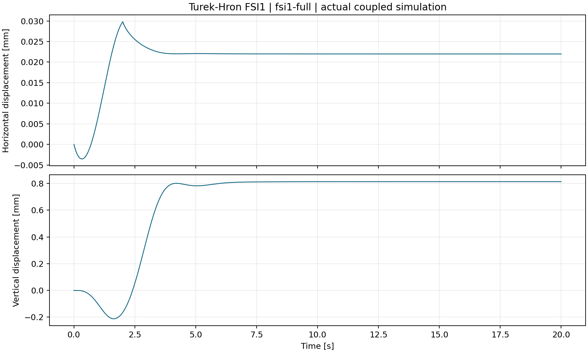
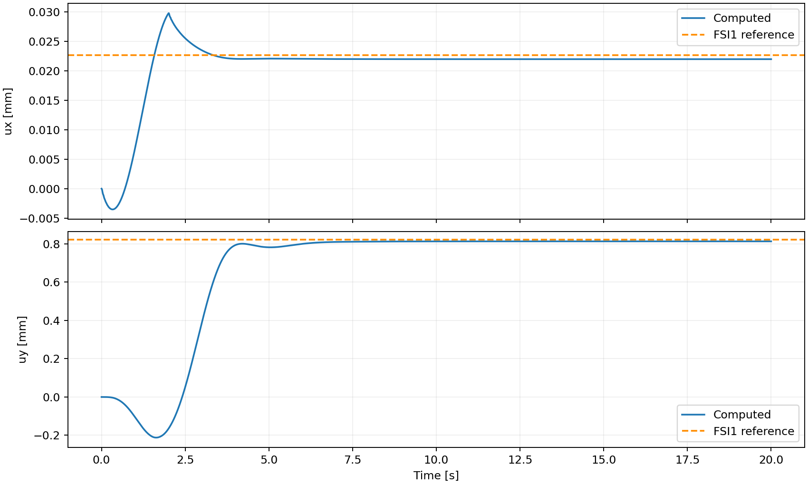
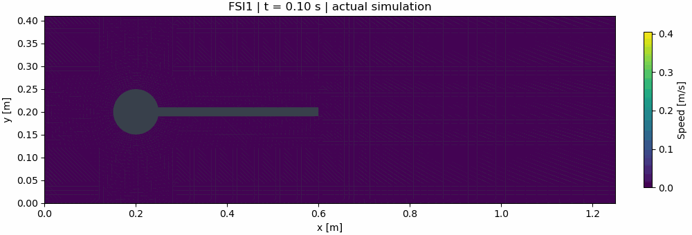

# OpenFOAM–preCICE–CalculiX FSI Benchmark

Partitioned fluid–structure interaction simulation of the Turek–Hron FSI1
benchmark using OpenFOAM, CalculiX and preCICE.

[](https://github.com/3426298310-del/openfoam-precice-fsi-benchmark/actions/workflows/ci.yml)

<p align="center">
  
  
</p>

<p align="center">
  
  
</p>

## Key Results

A complete 20 s FSI1 simulation — 2000 coupling windows, **0 unconverged**, mean
2.06 (max 4) coupling iterations per window — compared against the published
Turek–Hron reference:

| Metric | Relative error |
| --- | --- |
| Drag | −0.29 % |
| Lift | −0.60 % |
| Tip y-displacement uy | −0.94 % |
| Tip x-displacement ux | −3.2 % |

## What I built

A reproducible partitioned two-way FSI workflow, tested on Ubuntu 24.04, for the
classical Turek–Hron benchmark (steady case **FSI1**, Re = 20). The
incompressible flow past a fixed cylinder with an attached elastic beam is
solved by coupling two independent solvers at runtime:

- **OpenFOAM** (finite volume) solves the moving-mesh Navier–Stokes equations
  for the fluid.
- **CalculiX** (finite element) solves the geometrically nonlinear dynamics of
  the elastic beam.
- **preCICE** orchestrates the exchange of interface forces and displacements
  with an implicit (strong) coupling scheme accelerated by quasi-Newton methods.

The repository contains the case files, the coupling configuration, automated
install/build/run/postprocess scripts, and the post-processed results of a
complete 20 s reference run.

## My Contributions

The geometry, mesh, and original case are reused from an upstream
preCICE-tutorials pull request (preserved under `third_party/`, see
[`docs/SOURCES.md`](docs/SOURCES.md)). On top of that upstream material, I
implemented:

1. Migrated the original preCICE v2-style coupling setup to preCICE 3.x syntax.
2. Replaced the `groovyBC` inlet dependency with a native OpenFOAM
   `codedFixedValue` implementation.
3. Corrected the force-monitoring density configuration and unit-depth
   conversion.
4. Tuned coupling convergence settings and linear solver tolerances to obtain
   stable FSI1 convergence.
5. Built an isolated, reproducible run pipeline using Bash.
6. Implemented Python post-processing for tip displacement, drag/lift, coupling
   iteration statistics, and velocity/pressure/vorticity fields.
7. Completed and analyzed the full 20 s / 2000-window FSI1 simulation.
8. Quantitatively compared results with published Turek–Hron reference values.

## Repository Structure

| Path | Purpose |
| --- | --- |
| `fluid/` | OpenFOAM case (FSI1) |
| `solid/` | CalculiX input |
| `coupling/` | preCICE configuration (preCICE 3.x) |
| `scripts/` | install / run / post-processing |
| `results/` | post-processed FSI1 results (figures, CSVs, summary) |
| `docs/` | benchmark parameters, technical report, sources |
| `experimental/fsi3/` | FSI3 configuration (prepared, not fully run) |
| `third_party/` | upstream reference material (not authored here) |
| `.github/` | CI workflow |

## Solver architecture

```
              OpenFOAM (fluid)
        pimpleFoam · ALE moving mesh
                      |
                      |  surface forces (fluid -> solid)
                      v
                  preCICE
   serial-implicit · IQN-ILS · RBF mapping
                      ^
                      |  interface displacement (solid -> fluid)
                      |
              CalculiX (structure)
          ccx_preCICE · NLGEOM dynamics
```

This is **partitioned two-way coupling**: each solver advances in time
independently, and at every time window they exchange interface data until a
combined convergence criterion is met, so the fluid load and the structural
deformation are mutually consistent.

## Fluid solver

- OpenFOAM **v2312**, solver `pimpleFoam` (incompressible Navier–Stokes).
- 2D channel 2.5 m × 0.41 m, 6 306 cells, `empty` front/back patches.
- Parabolic inlet profile via `codedFixedValue` with a 2 s cosine start-up ramp;
  `movingWallVelocity` on the moving beam surface.
- `nCorrectors 2`, `nNonOrthogonalCorrectors 1`; linear-solver tolerances
  p `1e-8`, U `1e-9`.

## Structural solver

- CalculiX **2.20** coupled build `ccx_preCICE`.
- Elastic beam 0.35 m × 0.02 m, extruded 0.01 m in z, quadratic reduced
  elements `C3D20R`.
- Implicit direct dynamic step (`*DYNAMIC, DIRECT`) with geometric
  nonlinearity (`NLGEOM`); fixed at the leading edge, free at the tip.

## Coupling via preCICE

- preCICE **3.2.0**, `serial-implicit` coupling scheme.
- Data: fluid writes **Force**, solid writes **Displacement**.
- Mapping: global radial-basis-function (thin-plate splines), conservative for
  forces, consistent for displacements.
- Acceleration: **IQN-ILS** quasi-Newton with initial relaxation 0.1.
- Convergence: displacement `abs-limit 1e-8 / rel-limit 1e-6` (strict),
  force `rel-limit 1e-2` (strict), max 100 iterations per window.

## Benchmark setup

| Parameter | Value |
| --- | --- |
| Channel | 2.5 m × 0.41 m |
| Cylinder | centre (0.2, 0.2) m, radius 0.05 m |
| Beam | 0.35 m × 0.02 m, fixed at x = 0.25 m |
| Fluid density ρ_f | 1000 kg/m³ |
| Kinematic viscosity ν_f | 0.001 m²/s |
| Mean inlet velocity U | 0.2 m/s (Re = 20, based on D = 0.1 m) |
| Solid density ρ_s | 1000 kg/m³ |
| Young's modulus E | 1.4 MPa |
| Poisson's ratio ν_s | 0.4 |
| Time step / duration | 0.01 s / 20 s (2000 coupling windows) |

Full parameters are in [`docs/benchmark.json`](docs/benchmark.json); the FSI3
parameters are in [`docs/benchmark-fsi3.json`](docs/benchmark-fsi3.json).

## Numerical results

Steady-state values are averaged over the final 2 s of the 20 s run. All 2000
coupling windows converged (mean 2.06 iterations per window, max 4).

| Quantity | Simulation | Reference | Relative error |
| --- | --- | --- | --- |
| Tip x-displacement ux | 2.198e-5 m | 2.27e-5 m | −3.2 % |
| Tip y-displacement uy | 8.132e-4 m | 8.209e-4 m | −0.94 % |
| Drag | 14.253 N/m | 14.295 N/m | −0.29 % |
| Lift | 0.7592 N/m | 0.7638 N/m | −0.60 % |

Reference values: J. Hron, S. Turek, *A monolithic FEM solver for an ALE
formulation of fluid–structure interaction with configuration for numerical
benchmarking*, ECCOMAS CFD 2006. Forces are per unit depth (N/m); OpenFOAM
integrates the total force (pressure + viscous) over the cylinder and beam and
the value is divided by the 0.01 m thickness.

## Comparison with published reference values

The computed tip displacement and forces agree with the published benchmark
reference values to within a few percent (forces within 1 %). These results are
**compared against published benchmark reference values**, and are **not
claimed as formal verification**: mesh-independence and time-step-independence
have not yet been established. The status is recorded as
`compared_not_grid_verified` in
[`results/fsi1-full/summary.json`](results/fsi1-full/summary.json).

## Reproducibility

Software versions and the exact adapter commits are documented in
[`docs/SOURCES.md`](docs/SOURCES.md). The preCICE OpenFOAM and CalculiX adapters
are built from source (not vendored here) by the install script.

```bash
# 1. Install system packages and build both adapters from source
bash scripts/install.sh

# 2. Short smoke test (0.01 s) to check the full coupling chain
bash scripts/run.sh smoke 0.01 0.01 fsi1

# 3. Full FSI1 reference run (20 s, ~2000 coupling windows)
bash scripts/run.sh fsi1-full 20 0.01 fsi1

# 4. Post-process: displacement/force time series, coupling convergence,
#    reference comparison and field figures
python3 scripts/postprocess.py results/runs/fsi1-full
python3 scripts/render_fields.py results/runs/fsi1-full --animate
```

Each `run.sh` invocation creates an isolated directory under `results/runs/`
and refuses to overwrite an existing one. Raw solver logs remain there; the
compact, publication-ready artefacts are written to `results/<name>/`.

## Limitations

- No mesh-independence or time-step-independence study has been performed, so
  the agreement with the reference is numerical but not a formal verification.
- The geometry and mesh are reused from an upstream pull request
  (`third_party/`) that is not an officially released preCICE benchmark.
- The FSI3 configuration in `experimental/fsi3/` is prepared and passed short
  trial runs, but its complete 20 s simulation has **not** been completed; it is
  **not** part of the completed FSI1 benchmark results.

## License

Repository code and scripts are LGPL-3.0 (see `LICENSE`). The OpenFOAM adapter
is GPL-3.0, the CalculiX adapter is GPL-3.0 (modified CalculiX files
GPL-2.0-or-later). Third-party benchmark data belong to their authors.
